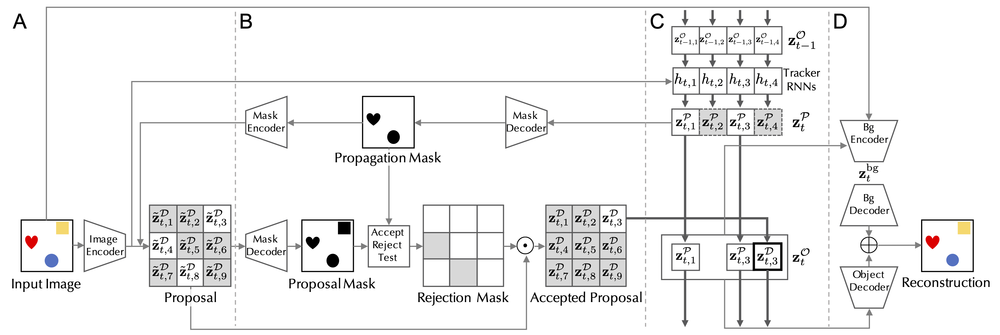
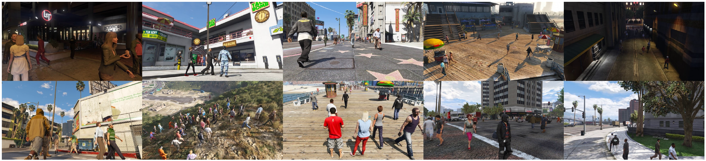

# Investigation on Unsupervised Object Representation Learning

This is a repository for my Guided Research course project at Technical University of Munich. In this project, we investigate several architectures for unsupervised object detection and tracking[1-4]. Out of these models, we found ["SCALOR: Generative World Models with Scalable Object Representations"](https://arxiv.org/abs/1910.02384) the most promising and decided to investigate the model further.

SCALOR is an interpretable deep generative model for videos of moving objects, structured by variational auto-encoders (VAEs)[5]. The model decomposes the sequence of frames into latent variables, where each latent variable focuses on different parts of the frame. With the latent variables, frames as reconstructed in such a way that it learns to detect and track objects. The overall pipeline of the model is as follows:



Getting labelled data for tracking and segmentation tasks are very hard, since it requires manuel labelling of pixels. That’s why learning to detect and track objects in unsupervised manner would be a crucial achievement, and also it might take us one step towards the general detection and tracking research.

SCALOR is shown to perform really well in toy datasets, and also with a real life example where camera is static and the background is easy to learn. Our main goal in this project was to see how SCALOR will break into more realistic scenarios. For that, we conduct our experiment with MOTSynth dataset, which includes numerous of different scenarios with hard background. The dataset is still synthetic, but it is much more photo-realistic than other toy datasets and it is well suited for detection and tracking tasks.



Since the dataset includes sequences from too many angles, and with different object sizes, we picked video sequences with static topdown view, where the object sizes are not changed significantly from object to object. Our initial experiments with SCALOR trained on the dataset resulted in poor performance in reconstruction and detection.


We hypothesized that the poor results are because of the different backgrounds, and the model was not able to learn different complex backgrounds. That's why we take the problem into a simpler environment, where we extract the backgrounds in the samples and replaced those with gradient background. Thereafter, we replaced the gradient background with a harder background to learn, in order to test model's ability to infer backgrounds with sharper transitions and edges.

#### Results with Gradient Background
As it can be seen from the visuals, that the reconstructions are looking similar to the real frames and the discovery and propagation modules are working as intended. In the first frame, the objects are getting discovered and then if they stay in the next frame, they are considered as propagated objects, which shows that the model learned both detection and tracking.


#### Results with Hard Background
The reconstructions failed with SCALOR trained on hard background.


## Adding Perceptual Loss

As it can be seen from the results, the reconstructive power of standard SCALOR failed with harder backgrounds. In order to improve the reconstructive power of the model, we added perceptual loss [6], where we used pre-trained VGG16 model's feature maps to focus on high-level features.


#### Results with Perceptual Loss Trained with blurred Background

As it can be seen from the visuals, that the Discovery module is able to detect the objects with hard bacground. But it still fails in the propagation part, resulting in the same objects getting rediscovered in the next frames.


As propagation failed in this experiment, we softened the background, by adding some Gaussian blur to the background. Additionally, on top of perceptual loss and variational objective function of standard SCALOR, we employed vanilla GAN[7] with aim of improving the reconstruction quality. The overall architecture looks like the following:


#### Results with Perceptual Loss + GAN loss Trained with blurred Background
As perceptual loss and GAN loss helped with reconstructions and blurred background simplified inferring the background, the model was able go generate good reconstructions event with the over-crowded sequence in the example. The discovery and propagation modules work as it was intended.


However, there is still the problem of extra-detection of the same objects from different grid cells. That is a result of SCALOR's lack of a mechanism like non-maxima suppression. In order to have a clear understanding of this problem, please have a look at the visuals below:

As it can be seen from the generated glimpses from each cell, different cells are focusing on the same objects sometimes, and also one cell can focus on 2 different objects.

As we had better results with perceptual loss and GAN loss added to standard SCALOR, we then experiment it in a multiple video setting like we did with standard version.

#### Results with Perceptual Loss + GAN loss Trained with Multiple Videos(8 videos)
As it can be seen from the visuals, the reconstructions with perceptual loss + GAN loss failed with multiple video sequences. The background generated is not clear. As the whole reconstruction is poor, the discovery and propagation modules are contributing the overall reconstruction instead of focusing on objects.


#### Analysis on Background Module

In this experiments, we wanted to experiment the importance of background encoder in single video sequence settings. We hypothesized that if the background is same for all sequences, there is no need for inferring the background. We trained the model on single sequence by removing the background encoder from the architecture and giving a random vector to the decoder for every sample, as it should generate to same background. We also removed random cropping from the training to get the same background for each sample. 


As it can be seen from the visuals, the background is generated very similar to the original background and the discovery and propagation modules worked as expected.

### Conclusion and Future Work

In this Guided Research project, we experimented SCALOR on photo-realistic synthetic dataset MOTSynth. Our goal was the understand how SCALOR will perform with harder sequences including different complex backgrounds. Both standard SCALOR, and SCALOR with perceptual and GAN losses failed to generate good reconstructions, resulting in also failing in detection and tracking tasks.

One other downside of the model is that there the grid cell approach is flexible with different object sizes, and also there is no mechanism to prevent repetition in detecting the same objects.

We also hypothesized that penalizing the generated alpha masks if they are closer to 0.5 would help getting better detections. But this is left as a future work as our initial experiments failed.

Lastly, as it is mentioned in the original paper, there is a need of a more complex background module, which would help the model to infer different and more complex backgrounds.

### Requirements
To install requirements:

```bash
conda env create -f environment.yml
```

To activate:

```bash
conda activate scalor_env
```
### Training

Please make sure you are using the correct Dataset Module for experiments.

- `MOTSynth` for original MOTSynth
- `MOTSynthBlackBG` for background extracted MOTSynth (It would work with gradient BG or Hard/blurred BG)

You can change the Dataset module and data directory in the beginning of each train scripts below:

To train regular SCALOR with default settings, run this command:

```bash
python train.py
```

To train SCALOR with perceptual loss with default settings, run this command:

```bash
python train_perceptual.py
```

To train SCALOR with perceptual loss and GAN loss with default settings, run this command:

```bash
python train_perceptual_gan.py 
```


### References

[1]Attend, Infer, Repeat: Generative Modelling of Moving Objects: Fast scene understanding with generative models, 2016, https://arxiv.org/abs/1603.08575


[2]Sequential Attend, Infer, Repeat: Generative Modelling of Moving Objects: SQAIR, 2018 https://arxiv.org/pdf/1806.01794.pdf

[3] Exploiting Spatial Invariance for Scalable Unsupervised Object Tracking (SILOT), 2020 https://arxiv.org/pdf/1911.09033.pdf

[4] SCALOR: GENERATIVE WORLD MODELS WITH SCALABLE OBJECT REPRESENTATIONS: SCALOR, 2019 https://arxiv.org/pdf/1910.02384.pdf

[5] Auto-Encoding Variational Bayes, https://arxiv.org/abs/1312.6114

[6] Perceptual Losses for Real-Time Style Transfer and Super-Resolution, https://arxiv.org/abs/1603.08155

[7] Generative Adversarial Networks, 2014, https://arxiv.org/abs/1603.08155

## SCALOR

This repository is the official implementation of ["SCALOR: Generative World Models with Scalable Object Representations"](https://arxiv.org/abs/1910.02384) by [Jindong Jiang](https://www.jindongjiang.me)\*, [Sepehr Janghorbani](http://janghorbani.net)\*, [Gerard de Melo](http://gerard.demelo.org), and [Sungjin Ahn](https://sungjinahn.com/); accepted at the *International Conference on Learning Representations* (*ICLR*) 2020. [Project Website](https://sites.google.com/view/scalor/home)


## Requirements

To install requirements:

```bash
conda env create -f environment.yml
```

To activate:

```bash
conda activate scalor_env
```

## Dataset

The "Grand Central Station" dataset can be downloaded [here](https://bit.ly/36tckTa). After downloading the file, extract the dataset using this command:

```bash
tar -xf grandcentralframes.tar.gz -C /path/to/dataset/
```


## Training

To train SCALOR with default settings, run this command:

```bash
python train.py --data-dir /path/to/dataset/
```


## Results


## Citation

```
@inproceedings{JiangJanghorbaniDeMeloAhn2020SCALOR,
  title={SCALOR: Generative World Models with Scalable Object Representations},
  author={Jindong Jiang and Sepehr Janghorbani and Gerard {de Melo} and Sungjin Ahn},
  booktitle={Proceedings of ICLR 2020},
  year={2020},
  publisher = {OpenReview.net},
  location = {Addis Ababa, Ethiopia},
  url = {https://openreview.net/pdf?id=SJxrKgStDH},
}
```

